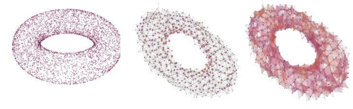

# 2-Mapper

The mapper algorithm is an unsupervised clustering algorithm used for used for data visualization in topological data analysis (TDA) \[1\]. 
It uses a range of parameters for constructing a graph from data chosen by the user. For a data set $X$,
to construct a mapper representation of $X$ one must choose the following parameters.

1. A filter function $f\colon X\to \mathbb{R}^m$ where $m\leq d$, e.g. projections through principle component analysis (PCA) \[2\].
2. An open cover $\mathcal{U}$ of $f(X)\subseteq\mathbb{R}^m$, e.g. uniform hypercubes $\mathcal{U} = \\{U_\alpha\\}$ where $U_\alpha = \prod_{i=1}^m \[a_{\alpha,i},b_{\alpha,i}\]$ for $a_{\alpha,i},b_{\alpha,i}\in\mathbb{R}$.
3. A clustering algorithm, e.g. DBSCAN \[3\].

The mapper graph is then the 1-dimensional nerve of the collection of clusters given after the clustering procedure.
This gives a good description of graphical connections in our data, but cannot tell us anything about topological 
features beyond dimension zero.
For filter functions that map to metric spaces of dimension $m\geq 2$, 
we can construct a mapper graph from the 2-dimsnional nerve, called **2-Mapper**.

2-Mapper is a simplical complex approximation of $X$. This can give visualization to density changes within a point cloud, 
and allow use to compute some approximate betti-1 values. We implement multiscale mapper \[4\] to identify how cover choice changes the 2-mapper structure by using persistence barcodes/diagrams.

See **2mapperTutorial.ipynb** and **Multiscale2mapper.ipynb** for tutorials for 2-mapper and multiscale 2-mapper, respectively.

References
----------
\[1\] Gurjeet Singh, Facundo M´emoli, and Gunnar E. Carlsson. Topological meth-
ods for the analysis of high dimensional data sets and 3d object recognition.
In Mario Botsch, Renato Pajarola, Baoquan Chen, and Matthias Zwicker,
editors, 4th Symposium on Point Based Graphics, PBG@Eurographics 2007,
Prague, Czech Republic, September 2-3, 2007, pages 91–100. Eurographics
Association, 2007.

\[2\] Harold Hotelling. Relations between two sets of variates. Biometrika, 28(3/4):321–377, 1936.

\[3\] Martin Ester, Hans-Peter Kriegel, J¨org Sander, and Xiaowei Xu. A density-
based algorithm for discovering clusters in large spatial databases with noise.
In Proceedings of the Second International Conference on Knowledge Dis-
covery and Data Mining, KDD’96, page 226–231. AAAI Press, 1996.

\[4\] Tamal K. Dey, Facundo Mémoli, and Yusu Wang. Mutiscale mapper: A framework for topological
summarization of data and maps. CoRR, abs/1504.03763, 2015.
